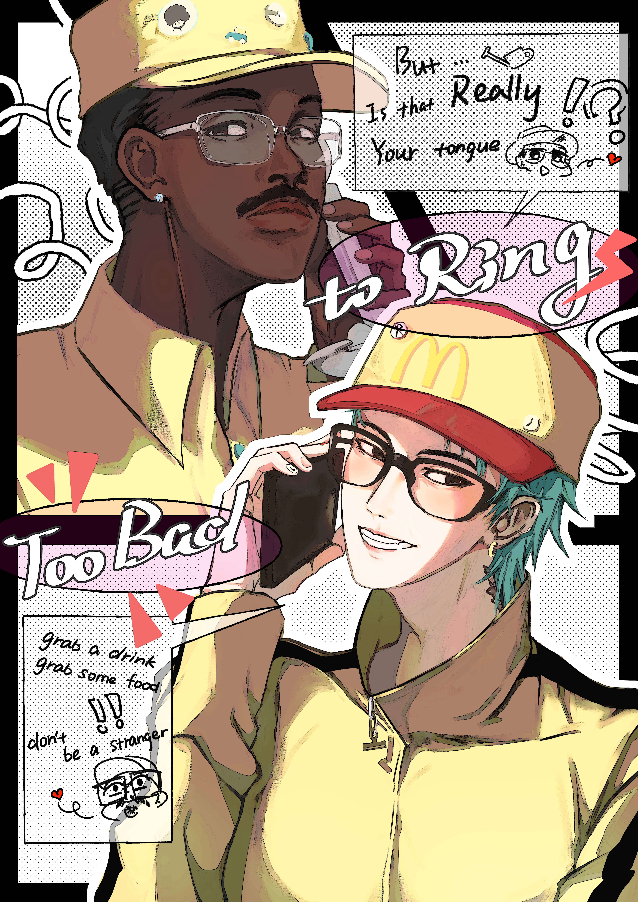
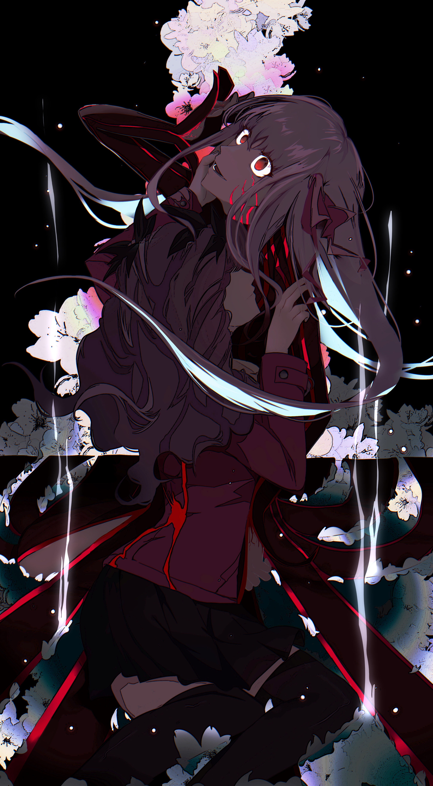
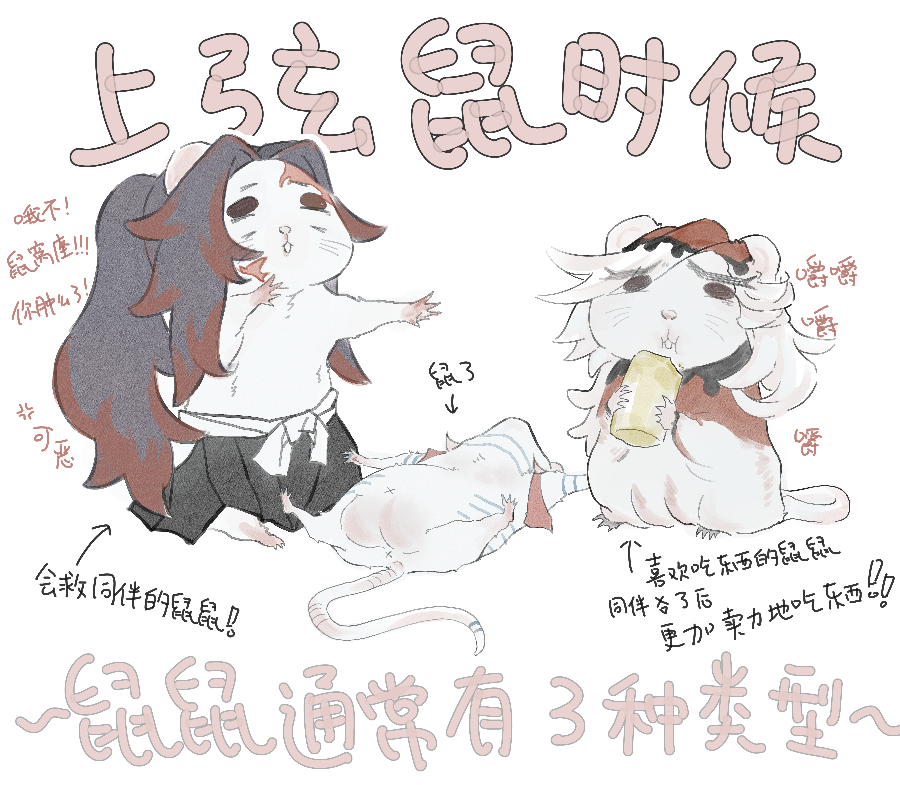
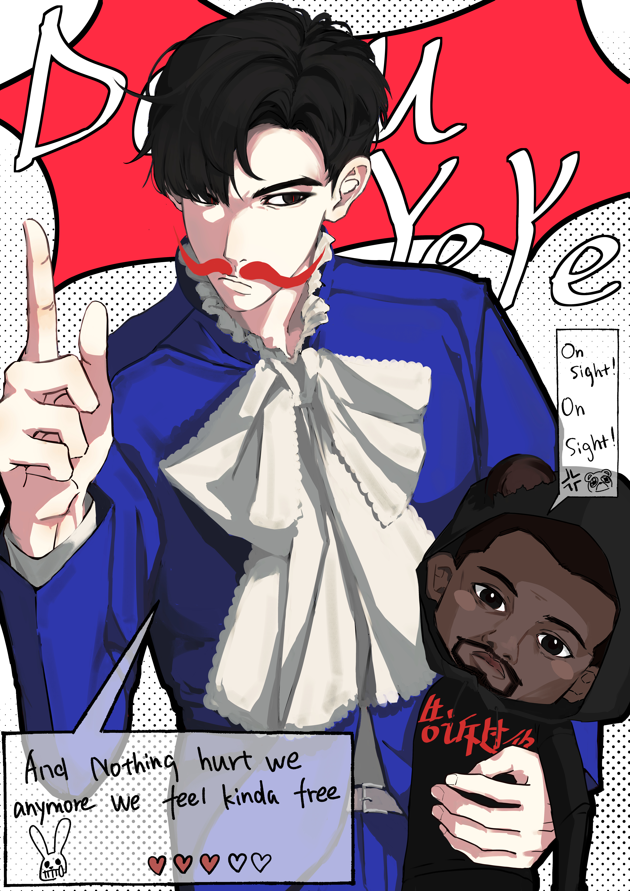

# Art Portfolio

**Peixi Bao · artist alias AR**

Selected digital illustration and visual design work.

I work across character illustration, fan art, pop-culture-inspired graphics, and personal visual experiments. My practice is especially interested in color, composition, character expression, visual storytelling, and the relationship between illustration and graphic design.

---

## Selected Work

### WOLVES — Self-Portrait

*A digital self-portrait built around personal cultural references. Elements of the clothing and accessories reference Kanye West, Lo Ta-yu, and G-Dragon — artists who have shaped my creative identity.*

---

### Still Life

*A portrait of G-Dragon built around bold color, negative space, and large-scale composition.*

---

### RINGRINGRING

*G-Dragon and Tyler, the Creator in a pop-inspired illustration combining character portraiture, typography, comic-panel language, and graphic design.*

---

### Sakura & Rin

*A fan illustration of Sakura Matou and Rin Tohsaka, focusing on intertwined figures, movement, dramatic lighting, and a darker anime visual language.*

---

### Lab Mice

*A playful character illustration turning laboratory mice into a small cast with distinct personalities, gestures, and comic interactions.*

---

### DOOMYEYE

*T.O.P and Kanye West in a playful pop-culture illustration mixing bold color blocking, comic graphics, handwritten typography, and character exaggeration.*

---

## Creative Practice

I primarily work in digital illustration, with interests spanning character design, editorial-style composition, pop culture, visual storytelling, and graphic design.

Alongside my work in epidemiology and public health research, I also enjoy applying visual thinking to posters, presentations, scientific communication, and other design-based projects.
